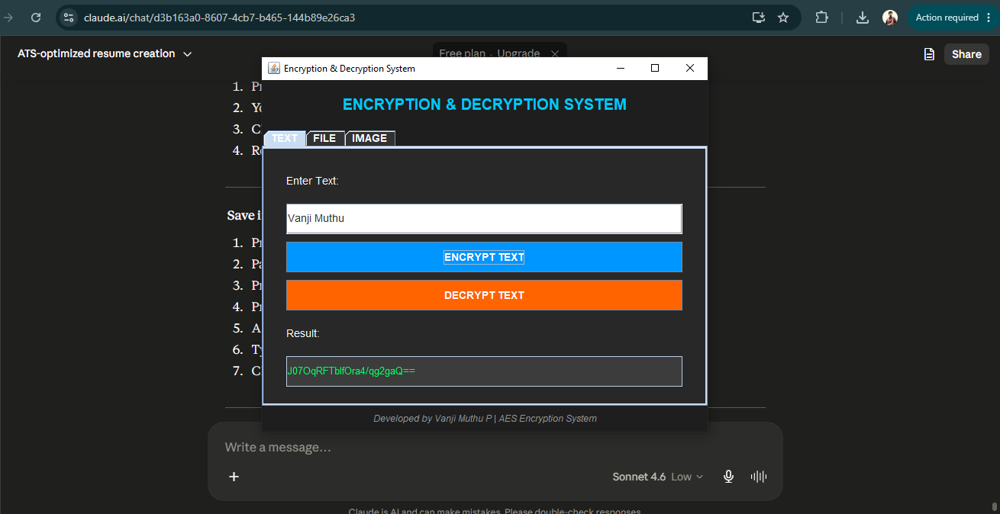
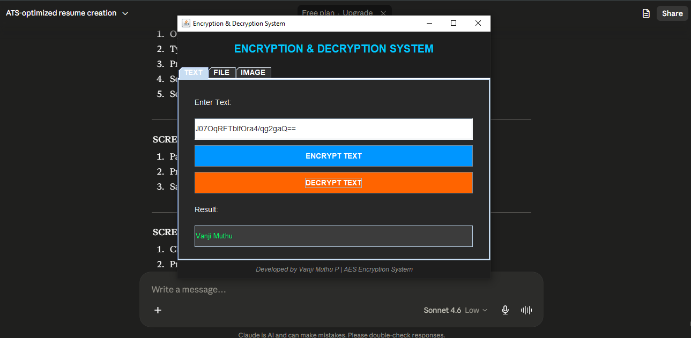
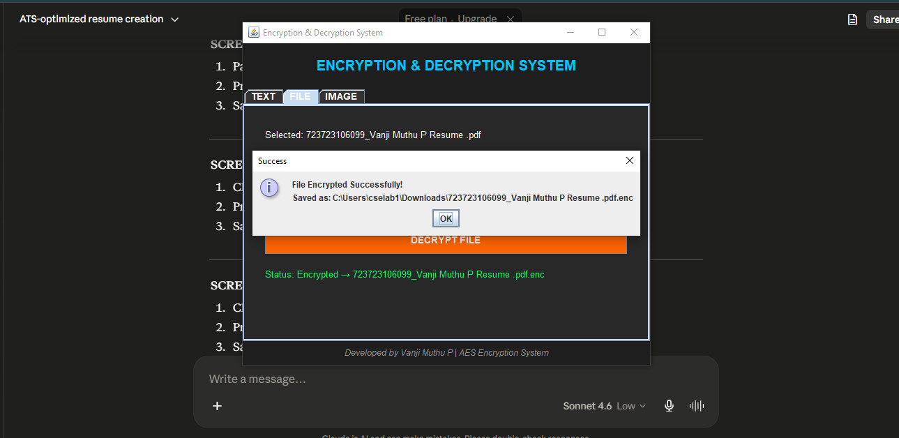
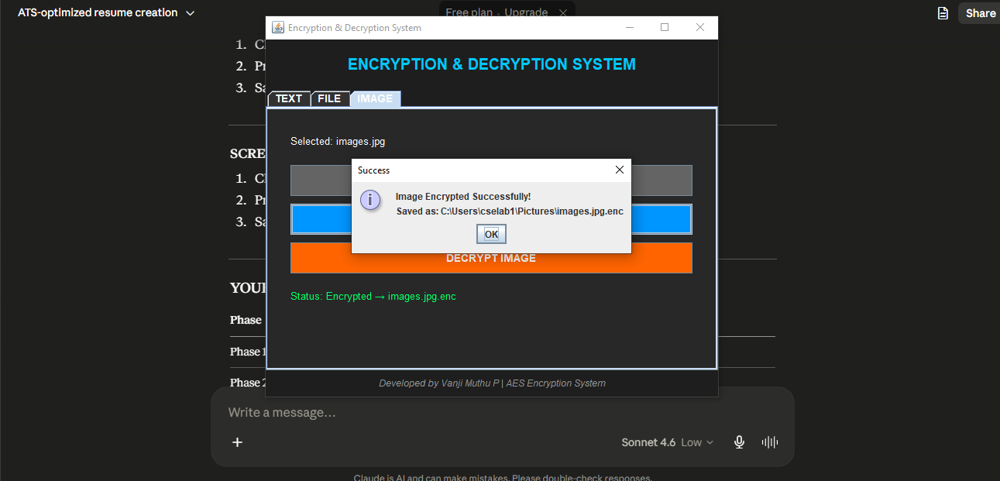

# Encryption & Decryption System

## About
A Multi-Mode Encryption and Decryption System
built using Java with AES-128 algorithm.
This project encrypts and decrypts Text, Files and Images
to protect sensitive data from unauthorized access.

## Features
- Text Encryption and Decryption
- File Encryption and Decryption
- Image Encryption and Decryption
- Java Swing GUI Interface
- AES-128 Industry Standard Algorithm

## Team Members
- P.VANJI MUTHU
- S. UDAIYAPPAN
- D. SATHIYAN

## College
V.S.B. College of Engineering Technical Campus
B.E., Electronics and Communication Engineering
Anna University - 2026

## Technologies Used
- Java
- AES-128 Algorithm
- Java Swing
- javax.crypto library

## How to Run
1. Download all files
2. Open terminal
3. Go to project folder
4. Compile: javac EncryptionGUI.java
5. Run: java EncryptionGUI
6. GUI window opens with 3 tabs

## Modules
- Module 1: Text Encryption and Decryption
- Module 2: File Encryption and Decryption
- Module 3: Image Encryption and Decryption

## Algorithm Used
- AES (Advanced Encryption Standard)
- Key Size: 128 bit
- Type: Symmetric Encryption
- Library: javax.crypto (Java built-in)

## Project Status
## Connect With Us
- GitHub: https://github.com/muhilvanji987-lang
- LinkedIn: https://www.linkedin.com/in/vanji-muthu-77b138381
- Email: muhilvanji987@gmail.com

## Screenshots
### Text Encryption

### Text Decryption

### File Encryption

### Image Encryption

## License
This project is open source and available for educational purposes

## Our Profiles

### Vanji Muthu P
- GitHub: https://github.com/muhilvanji987-lang
- LinkedIn: https://www.linkedin.com/in/vanji-muthu-77b138381
- Email: muhilvanji987@gmail.com

### S. Udhaiappan
### D. Sathiyan

## Project Links
- Repository: https://github.com/muhilvanji987-lang/Encryption-Decryption-System
- PPT: - PPT: [Encryption_Project_Professional_PPT.pptx](Encryption_Project_Professional_PPT.pptx)

